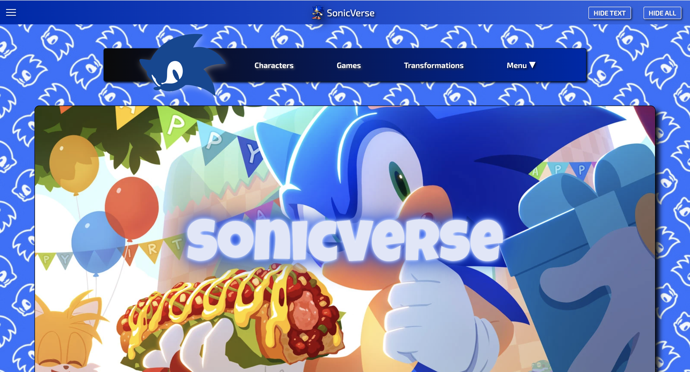
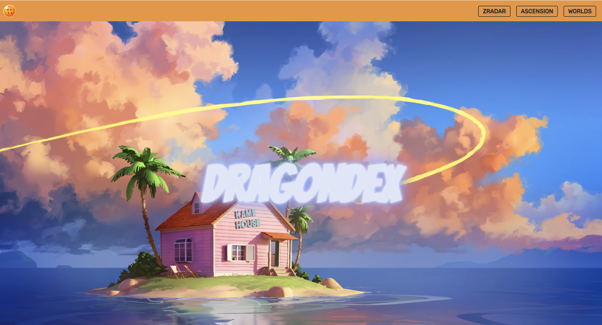

 
  
   
  
  
   
  

___

 
  <strong>A creative and detail-oriented Software Engineer and Geospatial Data Scientist with a deep passion for spatial intelligence, machine learning, and AI. I bring proven experience across the full technology stack—from front-end and back-end development to web application design, data wrangling, statistical analysis, and impactful data visualization. Known for strong logical reasoning, problem-solving, and a knack for thinking outside the box, I consistently seek innovative ways to improve systems and deliver meaningful results. I’m excited to contribute to a forward-thinking tech company with a global reach, where I can help drive data-driven innovation and create solutions that make a real-world impact.</strong>

🔭 I’m currently working on **D&D Compendium** and **SonicVerse**.

👨‍💻 All of my projects are available at:
- **Geospatial Portfolio:** [NomadGeo](https://github.com/NomadCode33/NomadGeo)
- **Software Engineering Portfolio:** [DevChronicles](https://github.com/NomadCode33/DevChronicles)

⚡ Fun fact **I have endless drive, I love learning, I have a stubborn attitude to never quit, and I love watching anime.**
___

<h2 align="center">Projects</h2>

<table bordercolor="#66b2b2">
  
  <tr>
    <td width="50%" valign="top">
      <h3 align="center">SonicVerse</h3>
         
        

        
        

         
        

  
  
        

        
<strong>HTML, CSS, JavaScript</strong> - A fully responsive, full-stack encyclopedia built from scratch featuring a custom RESTful API, MVC backend architecture, and dynamic search across characters and worlds—demonstrating end-to-end system design and scalable retrieval patterns.

    </td>
    <td width="50%" valign="top">
      <h3 align="center">SeaRise3D</h3>
         
        

        
        

         
        

    
        

        
<strong>ArcGIS Pro, ArcGIS Online, ArcGIS Living Atlas, ArcGIS 3D Analyst extension</strong> - A dynamic 3D map showing buildings in Miami at risk from sea level rise by 2030, 2050, and 2090, using spatial analysis to guide infrastructure planning and climate adaptation.

    </td>
  </tr>
  
  <tr>
    <td width="50%" valign="top">
      <h3 align="center">DragonDex</h3>
         
        

        
        

         
        

  
  
        

        
<strong>HTML, CSS</strong> - DragonDex is a responsive web app and interactive encyclopedia for the Dragon Ball universe, using a third-party API for dynamic search across characters, transformations, and worlds.

    </td>
    <td width="50%" valign="top">
      <h3 align="center">OsoShift</h3>
       
        
       
        

  
      

        
<strong>ArcGIS Pro</strong> - A compelling 3D animation of the catastrophic Steelhead Haven mudslide near Oso, WA, combining terrain data, imagery, and timelines to illustrate its progression, infrastructure impact, and environmental aftermath—enhancing preparedness and awareness.

    </td>
  </tr>
</table>

 
<h2 align="center">Skills/Technologies</h2>

 
   
   
  
  
  
  
  
  
  
  
  
  
  
  
  
  

   
  
   
   
    
   
  
  
  
  
   
   
   
   
   
   
   
   
   
   
  
  
  
  
  
   
  

    

 
 

___

<h2 align="center">Connect</h2>

  
   
  
  
  
  

